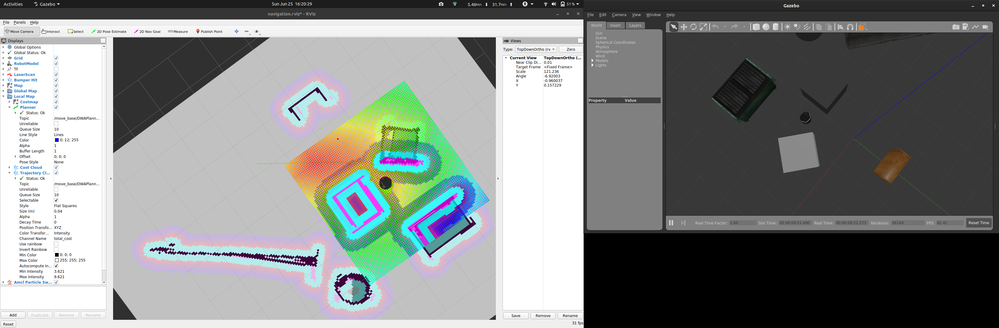

--->roslaunch turtlebot_gazebo turtlebot_world.launch

    Choose the World tab on the Gazebo left panel.
    Click on Models.
    Click on mobile_base and in the window below, you will see two columns: Property and Value.
    Click on the arrowhead at pose.

--->rosservice list | grep mobile_base
services list related to the turtlebot mobile base

--->rosservice call gazebo/get_model_state '{model_name: mobile_base}'
where the robot is located in the environment

--->rosnode list

--->rosnode info /cmd_vel_mux

to make the robot move.
--->roslaunch turtlebot_teleop keyboard_teleop.launch
--->rosnode info /turtlebot_teleop_keyboard

--->rostopic echo /odom
--->rostopic echo /odom/twist
Now you will see only the twist part of the odometry, it has two components, linear and angular, keep moving the turtlebot to see how they change.

/turtlebot_teleop_keyboard node publish to 
/cmd_vel_mux/input/teleop topic

need to kill /turtlebot_teleop_keyboard before it can move

move the TurtleBot in a simple straight line
--->rostopic pub -r 10 <topic> \geometry_msgs/Twist '{linear: {x: 0.1, y: 0, z: 0}, angular: {x: 0, y: 0, z: -0.6}}'

open up a pre-configured RViz file
--->roslaunch turtlebot_rviz_launchers view_robot.launch

Mapping
When using the metro type of representation of the map likely to have topological maps
When using the lateral & longitudinal type of representation of the map likely to have metric maps

In general a metric representation is more sensitive to sensor noise than a topological representation.

The Turtlebot uses a SLAM implementation called “gmapping”, and a laser scanner to gather information about the environment and build a map

Localization methods are grouped into two categories: Global and Local.

Global:

    Give a location with respect to the world
    Often inaccurate compared to local methods
    For example: GPS or Wi-Fi hotspots

Local:

    Give a location with respect to local sensor feedback
    Can be highly accurate compared to global methods
    For example laser scanner and on-board cameras

TurtleBot in simulation

To run the Turtlebot simulator, we will use the files that come with the course installation
--->roslaunch turtlebot_gazebo turtlebot_world.launch

gmapping is a specific SLAM implementation
--->roslaunch turtlebot_gazebo gmapping_demo.launch
--->rosnode info /slam_gmapping
Publications: 
 * /map [nav_msgs/OccupancyGrid]
 * /map_metadata [nav_msgs/MapMetaData]
 * /rosout [rosgraph_msgs/Log]
 * /slam_gmapping/entropy [std_msgs/Float64]
 * /tf [tf2_msgs/TFMessage]

Subscriptions: 
 * /clock [rosgraph_msgs/Clock]
 * /scan [sensor_msgs/LaserScan]
 * /tf [tf2_msgs/TFMessage]
 * /tf_static [tf2_msgs/TFMessage]

Services: 
 * /dynamic_map
 * /slam_gmapping/get_loggers
 * /slam_gmapping/set_logger_level

To visualize the mapping process open up RViz. We can open up a 'blank' RViz window and add our robot model and further settings. However, it's easier to load up a configuration
--->roslaunch turtlebot_rviz_launchers view_navigation.launch

    Set LaserScan/size(m) to 0.06
    Set LaserScan/style to 'flat squares'
    Set Localmap/Costmap/Topic to /map
    Set Globalmap/Costmap/Topic to /map

--->roslaunch turtlebot_teleop keyboard_teleop.launch
After moving around for a while you will have created a great map. This map will be very useful when we want to navigate the world. However, we need to save it somewhere

--->rosrun map_server map_saver -f $HOME/<choose a directory>/test_map

we will need to open up the nodes responsible for localization. In the second CCS execute:
--->roslaunch turtlebot_gazebo amcl_demo.launch map_file:=$HOME/<directory of map>/test_map.yaml
Note that the map file used should the yaml file
The amcl stands for Adaptive Monte Carlo Localization. This is a probabilistic localization system for a robot moving in 2D which uses a particle filter to track the pose of a robot against a known map.

Finally in a third CCS we will open up RViz to visualize the navigation.

--->roslaunch turtlebot_rviz_launchers view_navigation.launch

ROS navigation stack

    The ROS Navigation Stack is meant for 2D maps, square or circular robots with a holonomic drive, and a planar laser scanner, all of which a Turtlebot has. It uses odometry, sensor data, and a goal pose to give safe velocity commands.
    The node “move_base” is where all the magic happens in the ROS Navigation Stack.
    Uses a global and local planner to accomplish the navigation goal.
    Manages communication within the navigation stack.
    Sensor information is gathered (sensor sources node), then put into perspective (sensor transformations node), then combined with an estimate of the robots position based off of its starting position (odometry source node). This information is published so that “move_base” can calculate the trajectory and pass on velocity commands (through the base controller node).

Path planning tutorial
open the TurtleBot in Gazebo
--->roslaunch turtlebot_gazebo turtlebot_world.launch
open up the nodes responsible for localization and navigation
nodes responsible for localization
--->roslaunch turtlebot_gazebo amcl_demo.launch
uses a particle filter to track the pose of a robot against a known map (the default one is none is specified).This launcher also starts the move_base node, which is responsible for planning and controlling the movements of the robot. 

open up RViz to visualize the navigation
--->roslaunch turtlebot_rviz_launchers view_navigation.launch

