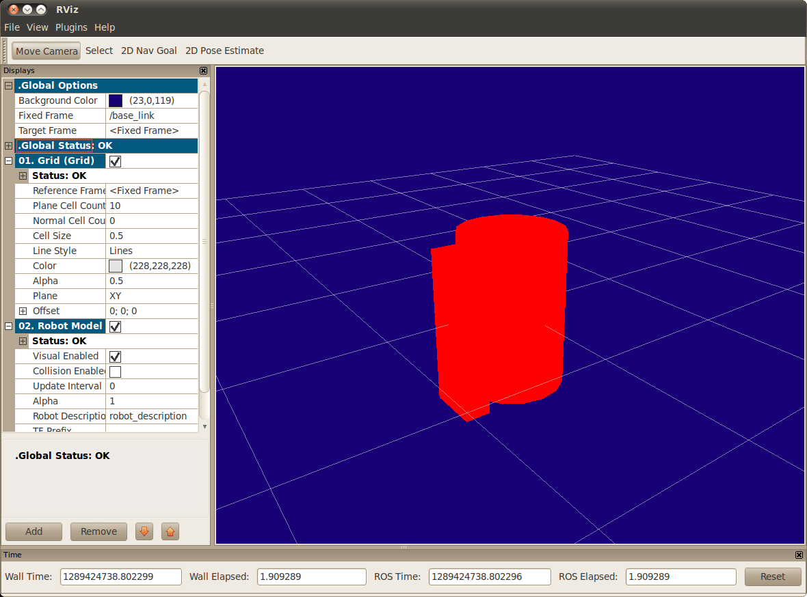

we’re going to focus on getting the visual geometry correct
make sure you have the joint_state_publisher package installed
installed urdf_tutorial using apt-get

http://wiki.ros.org/urdf/Tutorials/Building%20a%20Visual%20Robot%20Model%20with%20URDF%20from%20Scratch

http://wiki.ros.org/urdf/Tutorials/Building%20a%20Movable%20Robot%20Model%20with%20URDF

   1 <?xml version="1.0"?>
   2 <robot name="origins">
   3   <link name="base_link">
   4     <visual>
   5       <geometry>
   6         <cylinder length="0.6" radius="0.2"/>
   7       </geometry>
   8     </visual>
   9   </link>
  10 
  11   <link name="right_leg">
  12     <visual>
  13       <geometry>
  14         <box size="0.6 0.1 0.2"/>
  15       </geometry>
  16       <origin rpy="0 1.57075 0" xyz="0 0 -0.3"/>
  17     </visual>
  18   </link>
  19 
  20   <joint name="base_to_right_leg" type="fixed">
  21     <parent link="base_link"/>
  22     <child link="right_leg"/>
  23     <origin xyz="0 -0.22 0.25"/>
  24   </joint>
  25 
  26 </robot>
  

roslaunch urdf_tutorial display.launch model:=urdf/01-myfirst.urdf